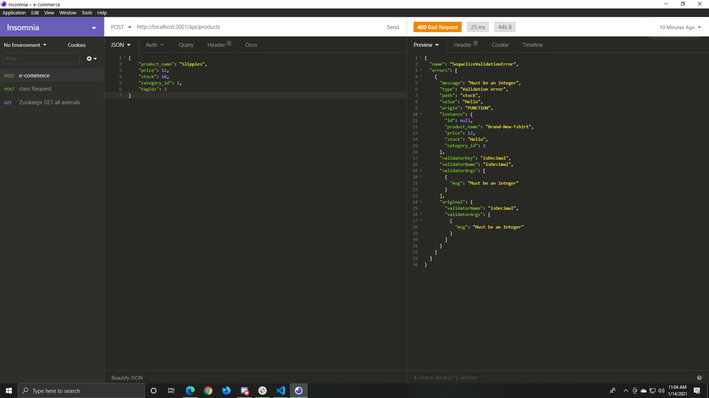
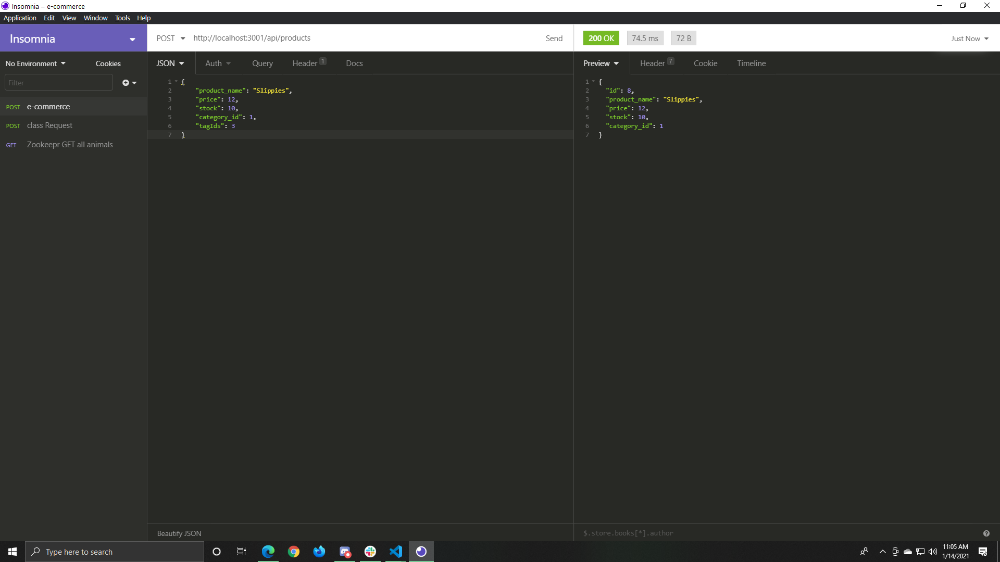

# E-Commerce Server

## Description
This is a Backend server/databse configuration for an E=Commerce Website! The application takes the CRUD requests you give it from the API and updates a database accordingly.

## Video Demo 
https://drive.google.com/file/d/1unt3O3eWPD_2tpEIFjvIWXd2l1dPhZFg/view

## How To Use 
If you do not have mysql installed, please be sure to go the mysql website, download and install.  
  
1: Run "npm install" and then "mysql -u root -p" and then enter your password.  
2: Inside of the mysql command shell, type "SOURCE schema.sql" and then "SOURCE seeds.sql".  
    ALTERNATE: Run "npm run seed".  
3: Exit you mysql command shell.  
4: Type "npm start" to begin the app.  
    ALTERNATE: Run "node server.js".  
5: Insert requests into insomnia or your browser of choice.  
6: view your JSON responses.  

## ScreenShots 

## Future Development
I would like to add a Front-End on to this application and Make the calls from inside of there.  

## Licenses
MIT

## Technology
Sequelize
Javascript    
NODE.js  
MYSQL2
Nodemon
Dotenv
Express

